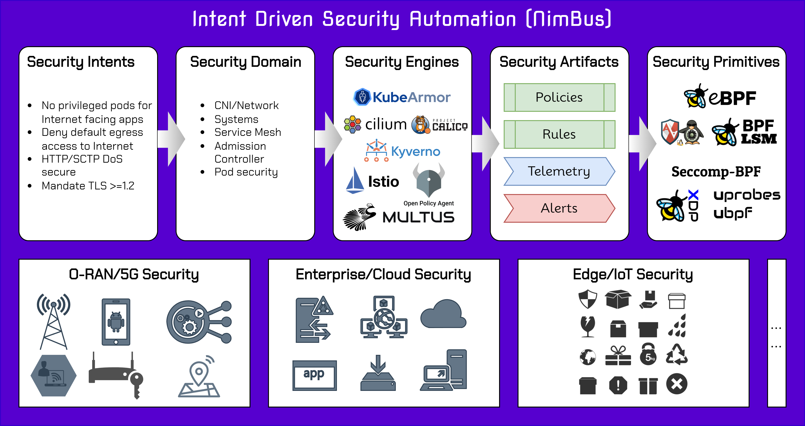

<!-- THIS IS AN AUTO-GENERATED FILE by ./scripts/gendoc.sh. DO NOT EDIT MANUALLY -->

# Security Intents for Intent Driven Security


Repository to hold Security Intents in standard template format.



## Security Threat Template
```yaml
title: Scenario-title
description: Detailed description of the scenario
severity: High/Medium/Low
tags:
  - oran
  - 5gcore
  - generic
detectionMethods: # Mechanisms to detect the threat
  - name: Application log
    tag:
      - mitre/ds0015
    description: Description # Optional
    url: https://...
  - name: Process
    tag:
      - accuknox/ax0015
    description: Description # Optional
    url: https://...
mitigationMethods: # Mechanisms to mitigate the threat
  - name: Update Software
    tag:
      - mitre/ds0015
    description: desc
    url: https://...
  - name: User Account Management
    tag:
      - accuknox/ax0015
    description: desc
    url: https://...
securityActions:
  - sample-sa-1.yaml
  - sample-sa-2.yaml
securityIntentBinding: # Set of labels, annotations describing workloads who would be impacted by this threat
  - sample-si-binding.yaml
preDeploymentConsiderations: [ ] # Anything that can be done in CI/CD pipelines that can alleviate this threat
references:
  - name: ref1
    url: https://...
  - name: ref2
    url: https://...
```

## Security Threats

| Title | Description | Severity | Security Actions | References |
|:-----:|-------------|----------|------------|------------|
   | [DNS Manipulation](threats/mitre/dnsManipulation.yaml) | An adversary can manipulate DNS requests to redirect network traffic and potentially reveal end user activity. | high | [accuknox/preventLocalDNSHijack](actions/accuknox/preventLocalDNSHijack), [mitre/integrityProtection](actions/mitre/integrityProtection), [mitre/networkTraffic](actions/mitre/networkTraffic) |[MITRE FiGHT](https://fight.mitre.org/techniques/FGT5006) |
   | [Exploit Public-Facing Application](threats/mitre/exploitPublicFacingApplication.yaml) |  | High | [accuknox/null](actions/accuknox/null) |[FGT1190](https://fight.mitre.org/techniques/FGT1190) |
   | [Exploit Semi-public Facing Application](threats/mitre/exploitSemiPublicFacingApplication.yaml) |  | High | [mitre/networkTraffic](actions/mitre/networkTraffic) |[FGT5029](https://fight.mitre.org/techniques/FGT5029) |
   | [SupplyChainCompromise](threats/mitre/supplyChainCompromise.yaml) | Adversaries may manipulate products or product delivery mechanisms prior to receipt by a final consumer for the purpose of data or system compromise. | High | [accuknox/null](actions/accuknox/null) |[FGT1195](https://fight.mitre.org/techniques/FGT51195) |
   | [Unauthorized access to Network Exposure Function (NEF) via token fraud](threats/mitre/unAuthAccessNEFTokenFraud.yaml) | An adversary controlling an (external) Application Function (AF) presents a fraudulent OAuth access token to access Network Exposure Function (NEF) services | High | [accuknox/null](actions/accuknox/null) |[FGT5011](https://fight.mitre.org/techniques/FGT5011) |
   | [Valid Accounts](threats/mitre/validAccounts.yaml) |  | High | [accuknox/null](actions/accuknox/null) |[FGT1078](https://fight.mitre.org/techniques/FGT1078) |

## Contributions welcome...

### Adding a new Security Threat

1. Fork and clone this repository
2. Copy `res/threatTemplate.yaml` template file in [threats](threats)/`tactic` directory and edit the file's contents to
   accurately reflect the specific threat information. For e.g., `execution` tactic from MITRE FiGHT.
   ```shell
   cp res/threatTemplate.yaml threats/execution/threat-name.yaml
    ```
3. Create the Security Actions file(s) you listed in the `.securityActions` field of the `threat-name.yaml` file, and
   place them within the [actions](actions) directory. For e.g.,
   ```yaml
   ...
   securityActions:
    - sample-sa-1.yaml 
    - sample-sa-2.yaml 
   ...
   ```
4. Run `make`
5. Raise a PR
